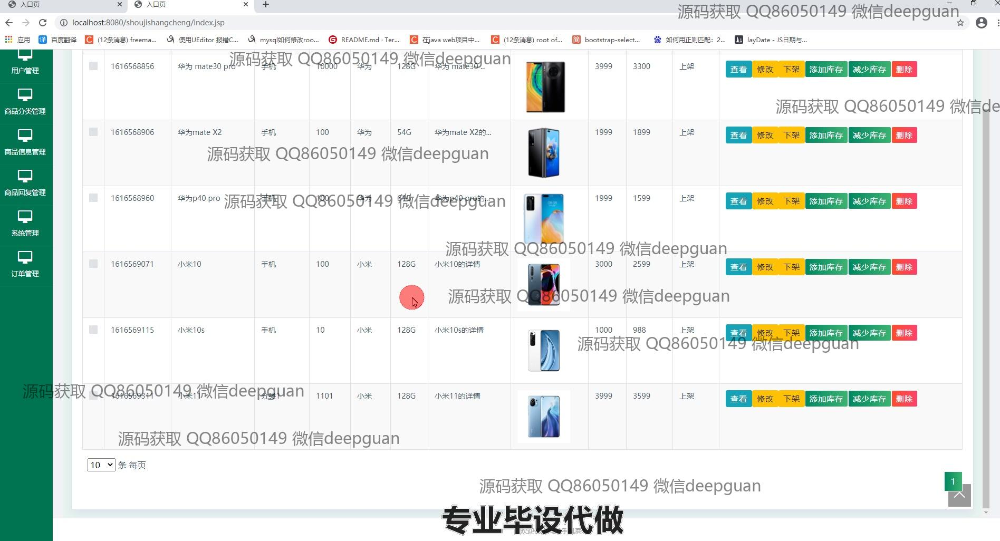
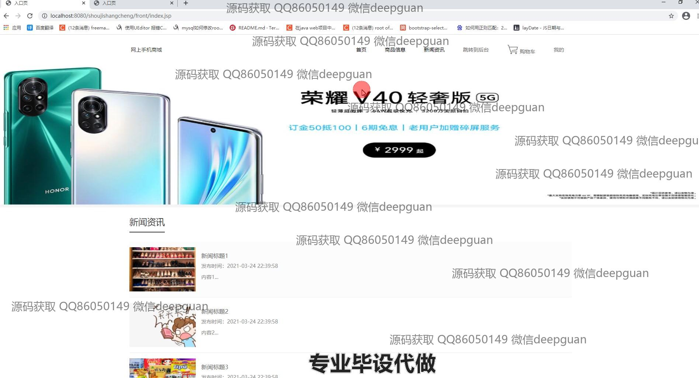
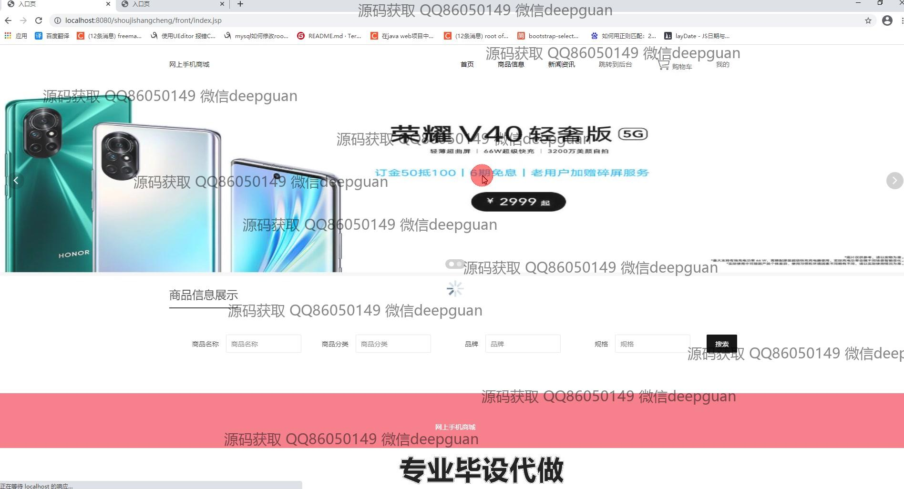
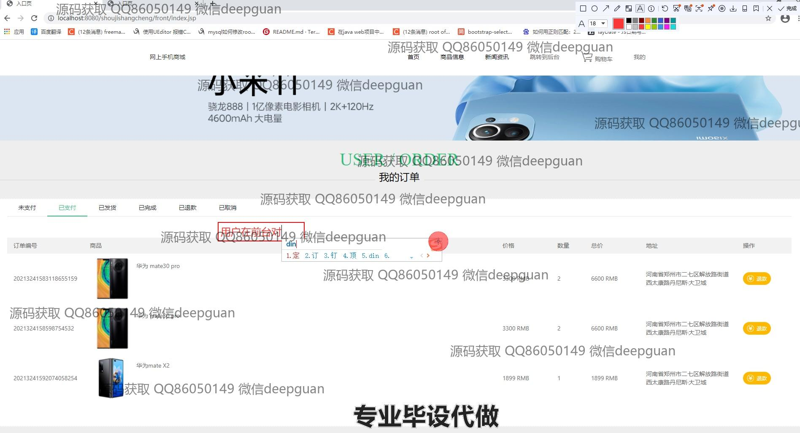

<h1 align="center">基于jsp的网上手机商城</h1>

## 简介
基于JSP的网上手机商城：提供用户管理、商品分类与信息管理、订单管理、轮播图管理、商品收藏、购物车、个人中心等功能，支持用户信息修改、商品上下架、订单状态查看及管理。    --计算机毕业设计源码；毕设源码；java毕业设计源码

## 联系方式

<h3 align="center">获取完整代码与数据库文件 + 微信：deepguan QQ: 86050149 QQ群: 783742310</h3>

<h3 align="center">可帮忙远程部署 包运行成功！提供远程部署、修改代码、设计文档指导、代码讲解等服务！</h3>

## 功能介绍（完整见运行截图）
管理员：登录、退出后台管理系统；管理用户信息、商品分类、商品信息、订单和系统设置；上传轮播图，编辑商品的详细信息如价格、库存、上下架状态；查看和处理订单，包括修改订单状态及退款操作；管理地址和积分记录。

用户：注册、登录、退出账户；浏览首页的商品推荐和新闻资讯；查看商品详情并加入购物车或直接购买；管理购物车，调整商品数量；结算订单并在线支付；查看个人信息，修改账户信息及密码；管理收货地址、收藏夹和订单状态，包括未支付、已发货等操作。

## 运行截图

本代码来源于网络,仅供学习参考使用!

